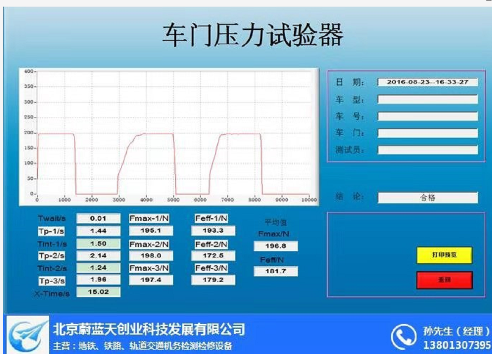
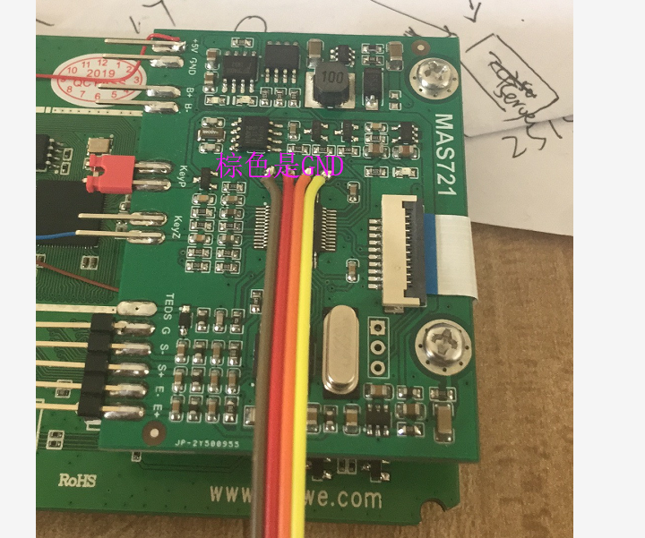

# 车门关力测试

## 手持电脑式数据采集仪参数
* 使用时长：常规约8小时
* 质    量：约455g
* 存    储：4GB SD存储卡
* 操作系统：linux
* 显    示：彩色触屏
*  数据容量：超过1000次车辆测量数据
* 防护等级：IP65.
* 可多次承受1.5m-水泥地面跌落测试，外表有皮套保护层并配有肩带；
*  USB线-用于数据从手持电脑式采集仪传输到PC端

## 参考界面

## MCU参数

* stm32f030 : ram 4k flash 16k 内部晶振

## ADC

* ADC: cs5530 【spi】
* 转换速率： ？ 未知
* 
参考电压3.3的时候读取出来的ad是溢出的
换成5v就对了

## RTC时钟

* 芯片是PCF8563
* 模拟I2C
* 可以通过手持仪表来设置时间
* 定时读取更新显示器

## 按键
* 开机和关机按键 同一个 测试通过
* 清零按键 测试通过
* 
## 参数
不需要保存

## TEDS

* 1wire 读取teds参数
* 
## 开关机电路

按住开机键后，硬件自动上电开机，开机后按住开机键，mcu检测到按键后，控制关掉电源

测试通过 ok

## led灯
测试通过

## 串口通讯

* 和LCD显示屏双向通讯，采用wz自定义协议框架
* LCD显示支持y-modem升级，发送指令模块复位，进入bootloader，进行升级.
* 因为串口被lcd占用了，所以升级只能靠lcd显示
* 
## 电池电量测量

* 参考

## 看门狗

* 防止下面单片机死机

## Bootloader

支持ymodem升级

## 调试口

## 存在的问题

* 串口屏不能同时插上usb，否则点不亮屏
* 电池电量测试
* 需要测试lcd插上usb，电池供电。板子的5v供电。